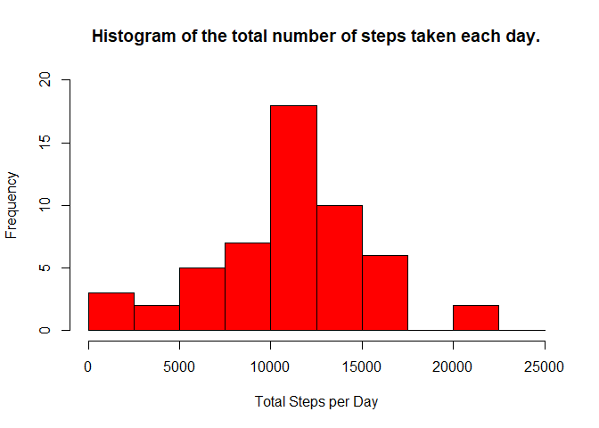
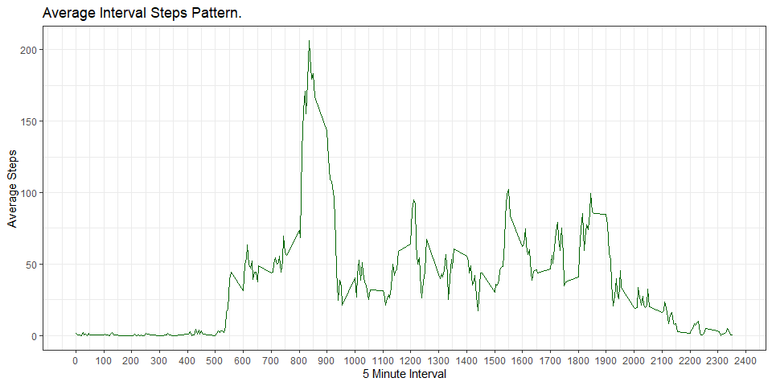
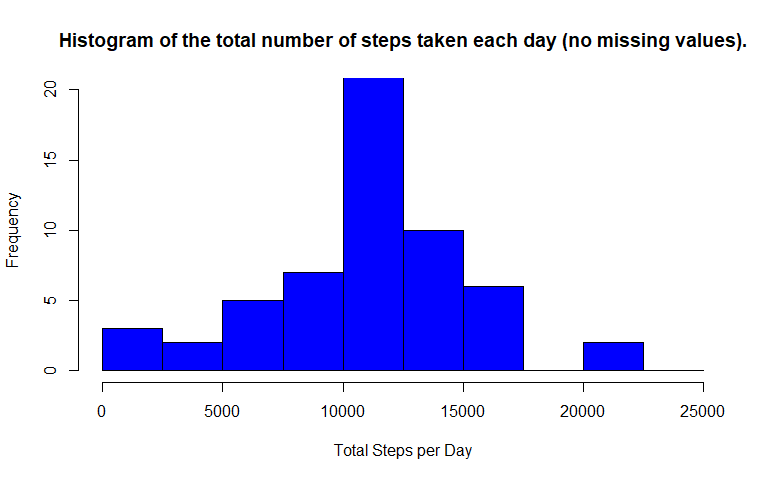
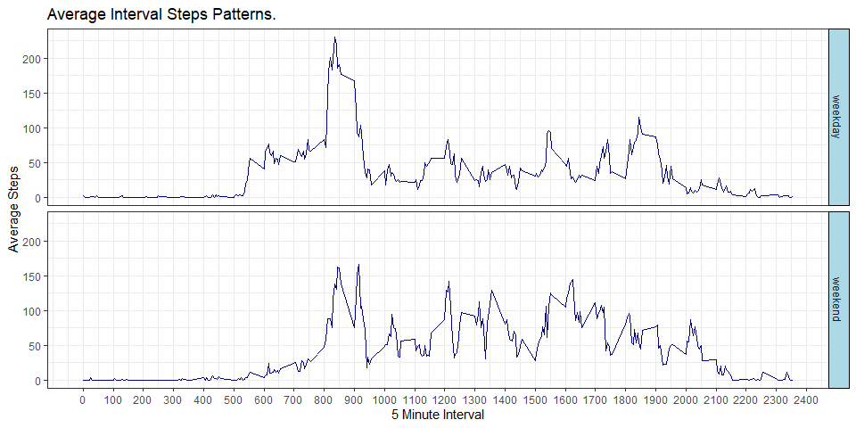

``` r
library(ggplot2)
suppressMessages(library(dplyr))  # for coalesce()
```

-----------------------------------------------------  

## Loading and preprocessing the data

``` r
tempdir = tempdir()
unzip("activity.zip", exdir=tempdir)
csv_path = file.path(tempdir, "activity.csv")
act = read.csv(csv_path, header=T, sep=",", na.strings="NA")
```

-----------------------------------------------------

## What is mean total number of steps taken per day?  
### 1. Calculate the total number of steps taken per day

``` r
sum_steps_per_day = aggregate(steps ~ date, data=act, FUN=sum)
```
  
  
### 2. Histogram of the total number of steps taken each day

``` r
s = seq(from=0, to=25000,2500)
hist(sum_steps_per_day$steps
     , breaks = s
     , xlim = range(s)
     , ylim = c(0, 20)
     , col = "red"
     , xlab = "Total Steps per Day"
     , main = "Histogram of the total number of steps taken each day."
     )
```

<!-- -->


### 3. Mean and median of the total number of steps taken per day

``` r
the_mean = mean(sum_steps_per_day$steps)
the_median = median(sum_steps_per_day$steps)
```
**The mean is 10766.1886792.**  
**The median is 10765.**

-----------------------------------------------------  

## What is the average daily activity pattern?
### 1. Make a time series plot (i.e.type = "l") of the 5-minute interval (x-axis) and the average number of steps taken, averaged across all days (y-axis)


``` r
interval_means = aggregate(steps ~ interval, data=act, FUN=mean)

ggplot(data=interval_means, aes(x=interval, y=steps)) +
      scale_x_continuous(breaks=seq(0,2500,by=100)) +
      geom_line(col="darkgreen") +
      theme_bw() +
      labs(x="5 Minute Interval") +
      labs(y="Average Steps") +
      labs(title="Average Interval Steps Pattern.")
```

<!-- -->

### 2. Which 5-minute interval, on average across all the days in the dataset, contains the maximum number of steps?

``` r
busiest_interval = interval_means$interval[which.max(interval_means$steps)]
```
**Interval 835 contains the maximum number of steps on average across all days.**


-----------------------------------------------------  

## Imputing missing values
### 1. Calculate and report the total number of missing values in the dataset (i.e. the total number of rows with NAs)

``` r
total_na = sum(is.na(act))
```
**The number of rows with missing values is 2304**

### 2. Devise a strategy for filling in all of the missing values in the dataset. The strategy does not need to be sophisticated. For example, you could use the mean/median for that day, or the mean for that 5-minute interval, etc.
Which days or intervals have NA values for steps?

``` r
na_recs = subset(act, is.na(steps), -c(steps))
dates_with_nas = aggregate(interval ~ date, data=na_recs, FUN=length)
dates_with_nas
```

```
##         date interval
## 1 2012-10-01      288
## 2 2012-10-08      288
## 3 2012-11-01      288
## 4 2012-11-04      288
## 5 2012-11-09      288
## 6 2012-11-10      288
## 7 2012-11-14      288
## 8 2012-11-30      288
```
The above output shows that all of the 2304 NA records fall into one of eight days. On each of those days, there are 288 NA values and therefore NO recorded steps values (288 intervals = 24 hours * 12 intervals/hour). So it would be pointless to fill in missing NA values by finding the average steps for each of those days. Instead, I'll take the average steps from identical intervals across all days for any record that is missing a step value.

``` r
avg_steps_by_interval = aggregate(steps ~ interval, data=act, FUN=mean)
```

### 3. Create a new dataset that is equal to the original dataset but with the missing data filled in.

``` r
actfull = merge(x=act, y=avg_steps_by_interval, by.x="interval", by.y="interval")
actfull$steps.x = coalesce(actfull$steps.x, actfull$steps.y)
actfull = actfull %>% rename(steps = steps.x)
actfull = subset(actfull, select=-steps.y)
```

### 4. Make a histogram of the total number of steps taken each day and Calculate and report the mean and median total number of steps taken per day.

``` r
s = seq(from=0, to=25000, by=2500)
sum_stepsfull_per_day = aggregate(steps ~ date, data=actfull, FUN=sum)

hist(sum_stepsfull_per_day$steps
     , breaks = s
     , xlim = range(s)
     , ylim = c(0, 20)
     , col = "blue"
     , xlab = "Total Steps per Day"
     , main = "Histogram of the total number of steps taken each day (no missing values)."
     )
```

<!-- -->


``` r
new_mean = mean(sum_stepsfull_per_day$steps)
new_median = median(sum_stepsfull_per_day$steps)
```
**The new mean is 10766.1886792.**  
**The new median is 10766.1886792.**

Mean and Median before imputing missing values:  
Mean: 10766.1886792  
Median: 10765  

- For the mean steps per day, imputing missing values made no change. This is because the days with missing step values had in fact <u>no</u> step values, hence had a missing daily total and were excluded from the mean steps per day calculation.  
- For the median steps per day, imputing missing values made an insignificant change.

-----------------------------------------------------  

## Are there differences in activity patterns between weekdays and weekends?
### 1. Create a new factor variable in the dataset with two levels – “weekday” and “weekend” indicating whether a given date is a weekday or weekend day.

``` r
actfull$typeday = factor(ifelse(weekdays(as.Date(actfull$date)) %in% c("Saturday", "Sunday"), "weekend", "weekday"))
```

### 2. Make a panel plot containing a time series plot (i.e.type = "l") of the 5-minute interval (x-axis) and the average number of steps taken, averaged across all weekday days or weekend days (y-axis). See the README file in the GitHub repository to see an example of what this plot should look like using simulated data.

``` r
intervalfull_means = aggregate(steps ~ interval + typeday, data=actfull, FUN=mean)

ggplot(data=intervalfull_means, aes(x=interval, y=steps)) +
      scale_x_continuous(breaks=seq(0,2500,by=100)) +
      geom_line(col="navy") +
      facet_grid(typeday ~ .) +
      theme_bw() +
      theme(
        strip.background = element_rect(fill="lightblue", color="black")
      ) +
      labs(x="5 Minute Interval") +
      labs(y="Average Steps") +
      labs(title="Average Interval Steps Patterns.")
```

<!-- -->

